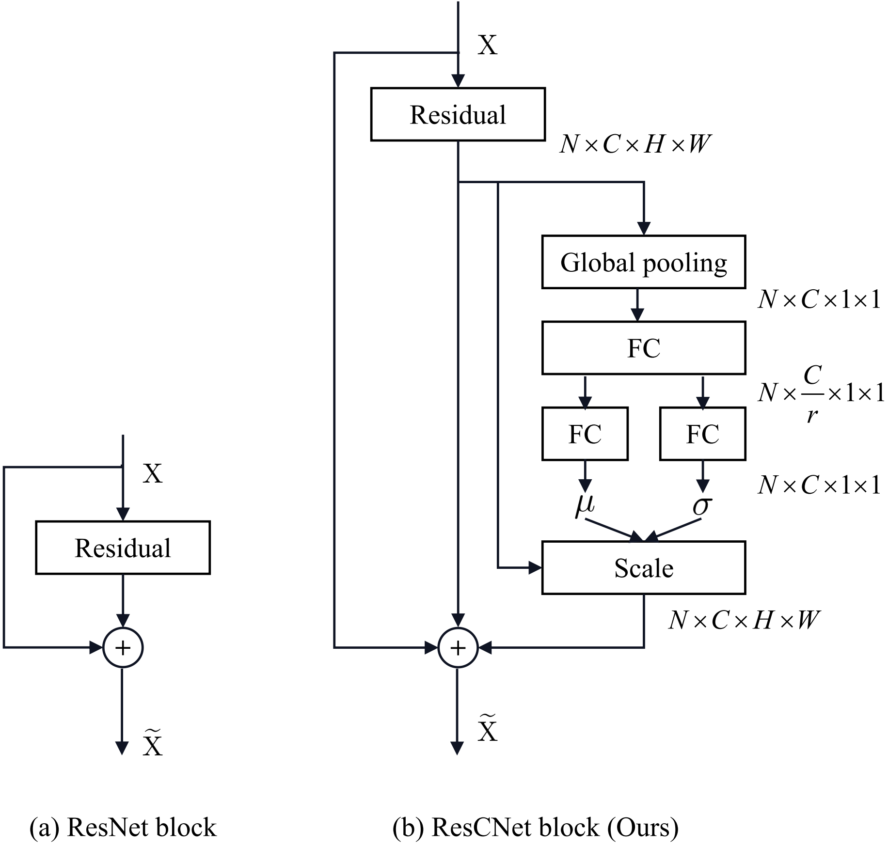

# ResCNet




模型架构文件在src文件夹下。


本仓库可用的模型列表：

```tex
# for imagenet
rescnet18, rescnet34, rescnet50 

# for cifar
rescnet32, rescnet56
rescnet50_c100
```


可训练的脚本文件请移步：https://github.com/tcmyxc/CV-Tutorial